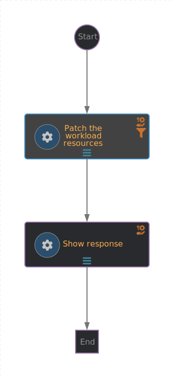

# Optimizer serverless workflow

This serverless workflow rightsizes a provided OpenShift workload based on its
project and deployment name. The optimized resources values are provided by the
[Resource Optimization for OpenShift API](https://developers.redhat.com/api-catalog/api/cost-management#content-operations-group-Optimizations).



## Running the application in dev mode

### Prerequisites:

- Install `mvn` and `quarkus` CLIs
- [Configure Maven with Red Hat and Maven Central repositories](#configuring-maven)
- Create a `.env` file at the project root directory and provide values for
  these two variables:
  ```sh
  OCP_API_SERVER_URL=...
  OCP_API_SERVER_TOKEN=Bearer ...
  ```

You can run your application in dev mode that enables live coding using:

```shell script
quarkus dev
```

or

```shell script
mvn compile quarkus:dev
```

> **_NOTE:_** Quarkus now ships with a Dev UI, which is available in dev-mode
> only at http://localhost:8080/q/dev/.

## Generating the deployments OpenShift OpenAPI spec

### Prerequisites:

- [Deno v2](https://deno.com/#:~:text=curl%20%2DfsSL%20https%3A//deno.land/install.sh%20%7C%20sh)
  (Or later)

Execute the following script and pipe its output to a file as follows:

```shell script
scripts/specs-generator.ts yaml > src/main/resources/specs/openshift-deployments-openapi.yaml
```

or for JSON output

```shell script
scripts/specs-generator.ts json > src/main/resources/specs/openshift-deployments-openapi.json
```

## Build and deploy the application for the Red Hat Developer Hub workflow orchestrator plug-in

### Prerequisites

- `kn` and `kn-workflow`
  ([Serverless workflow plugin for the Knative CLI](https://docs.openshift.com/serverless/1.35/install/installing-kn.html))
- `yq`
- `oc` (or `kubectl`)
- Podman (or Docker)

Execute:

```shell script
scripts/orchestrator-builder.sh \
  --image=quay.io/acme/optimizer:8.8.8 \
  --namespace sonataflow-infra \
  --deploy
```

Additional options are available, use `--help` to see the full list.\
After the deployment is complete update the `optimizer-creds` k8s secret with
the correct values for your environment.

## Packaging and running the application

The application can be packaged using:

```shell script
mvn package
```

It produces the `quarkus-run.jar` file in the `target/quarkus-app/` directory.
Be aware that it’s not an _über-jar_ as the dependencies are copied into the
`target/quarkus-app/lib/` directory.

The application is now runnable using
`java -jar target/quarkus-app/quarkus-run.jar`.

If you want to build an _über-jar_, execute the following command:

```shell script
mvn package -Dquarkus.package.type=uber-jar
```

The application, packaged as an _über-jar_, is now runnable using
`java -jar target/*-runner.jar`.

## Creating a native executable

You can create a native executable using:

```shell script
mvn package -Dnative
```

Or, if you don't have GraalVM installed, you can run the native executable build
in a container using:

```shell script
mvn package -Dnative -Dquarkus.native.container-build=true
```

You can then execute your native executable with:
`./target/serverless-workflow-project-1.0.0-SNAPSHOT-runner`

If you want to learn more about building native executables, please consult
https://quarkus.io/guides/maven-tooling.

## Configuring Maven

Edit your `$HOME/.m2/settings.xml` file.

1. Add these profiles to the `<profiles>` section:
   ```xml
   <profile>
     <id>redhat</id>
     <repositories>
       <repository>
         <id>redhat-ga</id>
         <url>https://maven.repository.redhat.com/ga/</url>
         <releases>
           <enabled>true</enabled>
         </releases>
         <snapshots>
           <enabled>false</enabled>
         </snapshots>
       </repository>
       <repository>
         <id>redhat-ea</id>
         <url>https://maven.repository.redhat.com/earlyaccess/all</url>
         <releases>
           <enabled>true</enabled>
         </releases>
         <snapshots>
           <enabled>false</enabled>
         </snapshots>
       </repository>
     </repositories>
     <pluginRepositories>
       <pluginRepository>
         <id>redhat-ga</id>
         <url>https://maven.repository.redhat.com/ga/</url>
         <releases>
           <enabled>true</enabled>
         </releases>
         <snapshots>
           <enabled>false</enabled>
         </snapshots>
       </pluginRepository>
       <pluginRepository>
         <id>redhat-ea</id>
         <url>https://maven.repository.redhat.com/earlyaccess/all</url>
         <releases>
           <enabled>true</enabled>
         </releases>
         <snapshots>
           <enabled>false</enabled>
         </snapshots>
       </pluginRepository>
     </pluginRepositories>
   </profile>

   <profile>
     <id>maven-central</id>
     <repositories>
       <repository>
         <id>maven-central-repo</id>
         <name>Maven Central Repository</name>
         <url>https://repo.maven.apache.org/maven2/</url>
         <layout>default</layout>
         <releases>
           <enabled>true</enabled>
           <updatePolicy>never</updatePolicy>
         </releases>
         <snapshots>
           <enabled>false</enabled>
           <updatePolicy>never</updatePolicy>
         </snapshots>
       </repository>
     </repositories>
     <pluginRepositories>
       <pluginRepository>
         <id>maven-central-plugins</id>
         <name>Maven Central Repository</name>
         <url>https://repo.maven.apache.org/maven2/</url>
         <layout>default</layout>
         <releases>
           <enabled>true</enabled>
           <updatePolicy>never</updatePolicy>
         </releases>
         <snapshots>
           <enabled>false</enabled>
           <updatePolicy>never</updatePolicy>
         </snapshots>
       </pluginRepository>
     </pluginRepositories>
   </profile>
   ```
2. Activate the above profiles by adding them to the `<activeProfiles>` section:

   ```xml
   <activeProfile>redhat</activeProfile>
   <activeProfile>maven-central</activeProfile>
   ```

## Related Guides

- Kubernetes ([guide](https://quarkus.io/guides/kubernetes)): Generate
  Kubernetes resources from annotations
- Kogito Jobs Service Knative Eventing Add-On
  ([guide](https://quarkus.io/guides/kogito)): Kogito Add-On to interact with
  the Kogito Jobs Service using events via the knative eventing system
- KIE Monitoring Prometheus Add-On ([guide](https://quarkus.io/guides/kie)):
  Kogito Add-On for Prometheus Monitoring
- SmallRye Health ([guide](https://quarkus.io/guides/smallrye-health)): Monitor
  service health
- SonataFlow Quarkus Extension ([guide](https://quarkus.io/guides/sonataflow)):
  Quarkus Extension to include the SonataFlow engine
- KIE Events Process Add-On ([guide](https://quarkus.io/guides/kie)): KIE Add-On
  for Processes Events
- KIE Process Management Add-On ([guide](https://quarkus.io/guides/kie)): KIE
  Process Management REST API
- KIE Kubernetes Add-On ([guide](https://quarkus.io/guides/kie)): Adds support
  for Kubernetes integrations within KIE engine.
- KIE Knative Eventing Add-On ([guide](https://quarkus.io/guides/kie)): Adds
  support for CloudEvents on top of HTTP and Knative env vars configuration.
- KIE Source Files Add-On ([guide](https://quarkus.io/guides/kie)): KIE Add-On
  to Provide access to source files for Quarkus
- Kogito Add-On Microprofile Config Service Catalog
  ([guide](https://quarkus.io/guides/kogito)): Kogito Add-On to use the service
  discovery API at the time the resolved values can be configured as properties

## Provided Code

### SmallRye Health

Monitor your application's health using SmallRye Health

[Related guide section...](https://quarkus.io/guides/smallrye-health)

<!--
  Licensed to the Apache Software Foundation (ASF) under one
  or more contributor license agreements.  See the NOTICE file
  distributed with this work for additional information
  regarding copyright ownership.  The ASF licenses this file
  to you under the Apache License, Version 2.0 (the
  "License"); you may not use this file except in compliance
  with the License.  You may obtain a copy of the License at

    http://www.apache.org/licenses/LICENSE-2.0

  Unless required by applicable law or agreed to in writing,
  software distributed under the License is distributed on an
  "AS IS" BASIS, WITHOUT WARRANTIES OR CONDITIONS OF ANY
  KIND, either express or implied.  See the License for the
  specific language governing permissions and limitations
  under the License.
  -->

### SonataFlow Serverless Workflow codestart

To learn more about SonataFlow (aka: Kogito Serverless Workflow) and its Quarkus
codestart [see this guide section...](https://quarkus.io/guides/sonataflow)
